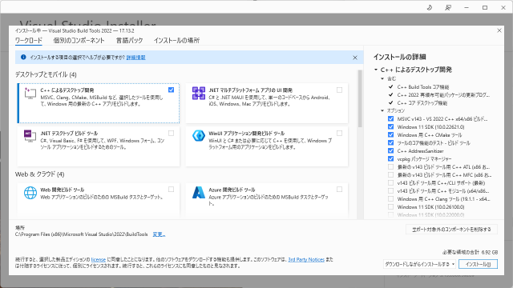
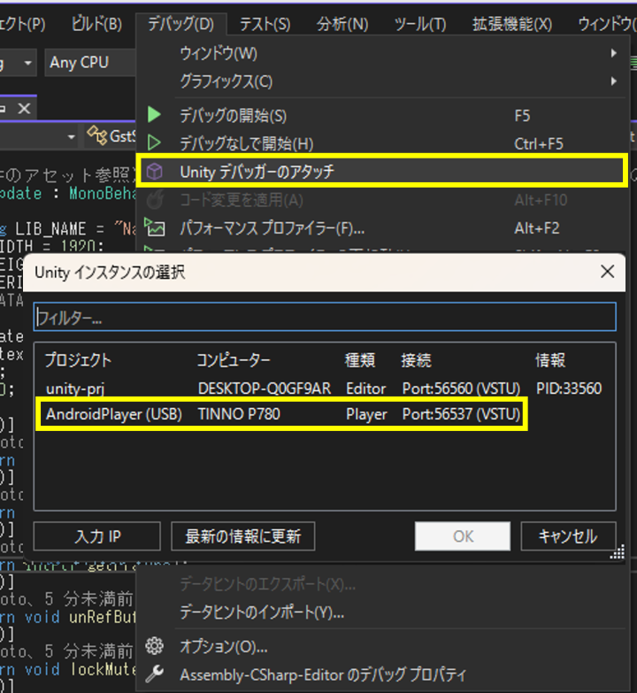
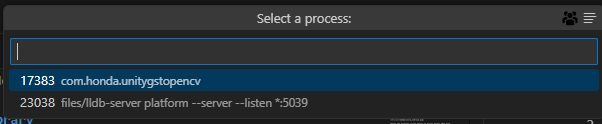

## Dependencies
* Unity (Recommended version is 6000.0.41f1)
* Visual Studio 2022 (for debugging Unity's C# scripts) 
* VS Code (for debugging a C++ dynamic link library)
* OpenCV (Recommended version is 4.11.0)
* GStreamer (Recommended version is 1.26.0)

## Preparation
### Visual Studio 2022
Add the "Desktop development with C++" workload.



### Unity
Add the module of Android Build Support.


Change the external script editor to Visual Studio 2022 via "Edit -> Preferences".


### VS Code
Add the following extensions.
* C/C++
* CMake Tools
* CodeLLDB

### OpenCV
Download OpenCV for both of Windows and Android from [the official site](https://opencv.org/releases/).
Windows version is .exe, but this is a self-extracting archive.
Place the uncompressed folders as follows:
```
unity-gst-opencv/
└── opencv/
    ├── windows/
    │   ├── build/
    │   └── sources/
    └── android/
        ├── samples/
        └── sdk/
```

### GStreamer
Download GStreamer for both of Windows (MSVC 64-bit) and Android from [the official site](https://gstreamer.freedesktop.org/download/#windows).
The site offers only an installation package for Windows, so please install it.
Android version is a compressed file.
Place the uncompressed folder as follows:
```
unity-gst-opencv/
└── gstreamer/
    └── android/
        ├── arm64/
        ├── armv7/
        ├── x86/
        └── x86_64/
```

### CMakePresets.json and .vscode/settings.json
CMakePresets.json and settings.json need correct paths of tools and libraries.
Especially, the paths of the following tools are specified as absolute paths.
The assumed default installation directories are as follows:
* Unity Editor
    * C:/Program Files/Unity/Hub/Editor/6000.0.41f1/Editor
* GStreamer for Windows.
    * C:/Program Files/gstreamer

If you chose different directories, change the corresponding lines in these config files.

## How to run or build
### Build C++ dynamic link library
1. Launch VS Code
1. Open the library folder (unity-gst-opencv -> native-lib)
1. Click the "CMake" icon in the left sidebar
1. Add "Build" and "Install" to "PINNED COMMANDS"
1. Select a configuration preset
1. Select "Delete Cache and Reconfigure"
1. Select "Build" from "PINNED COMMANDS"
1. Select "Install" from "PINNED COMMANDS"


### Play in Unity
1. Launch Unity
1. Open the Unity project folder (unity-gst-opencv -> unity-prj)
1. Open the scene (Scenes -> SampleScene)
1. Click "Play" in Unity after building the library above.


### Build for Android
1. Select "File -> Build Profiles".
1. Select "Android" from "Platforms"
1. Click "Switch Platform" if the "Build And Run" button does not appear
1. Connect and choose your Android device  
(Not needed if you want to only build)
1. Click "Build And Run" or only "Build"


## How to debug
### Debug Unity's C# scripts
#### Unity Play
1. Switch to debug mode from the bottom-left corner of the Unity window
1. Open the script from "Assets -> Scripts"
1. Attach to Unity from Visual Studio
1. Click "Play"


#### Android device
1. Enable "Development Build" and "Script Debugging" in "Build Profiles"  
(See the above image in "Build for Android")
1. Connect and choose your Android device
1. Click "Build And Run"
1. Open the script from "Assets -> Scripts"
1. Wait for the app to launch on your device
1. Select "Debug -> Attach to Unity Debugger" in Visual Studio.
1. Select your device



### Debug C++ dynamic link library
#### Unity Play
1. Build and install C++ dynamic link library with the configuration "x64 Debug"  
(See the above section "Build C++ dynamic link library")
1. Launch Unity
1. Click "Run and Debug" icon in the left sidebar of VS Code
1. Select "Attach to Unity (CppVSDbg)"
1. Click the "Start Debugging" button
1. Type "Unity.exe" into "Select the process to attach to" and Select "Unity.exe"  
(If you find multiple Unity processes, try a few times until you find the correct one)
1. Start "Play" in Unity


If you fix something in the dynamic link library after "Play" in Unity, you must reboot Unity before you reinstall the library. (Unity doesn't unload libraries loaded once.) 

#### Android device
1. Build and install C++ dynamic link library with the configuration "Android Debug"  
(See the above section "Build C++ dynamic link library")
1. Build and run the Unity project for Android
(See the above section "Build for Android")
1. Click the "Run and Debug" icon in the left sidebar of VS Code
1. Select "Terminal -> Run Task -> Run LLDB Server"
1. Select "Attach to Android (LLDB)"
1. Select the "com.honda.unitygstopencv" process
1. After finishing debugging, Select "Terminal -> Run Task -> Kill LLDB Server"

